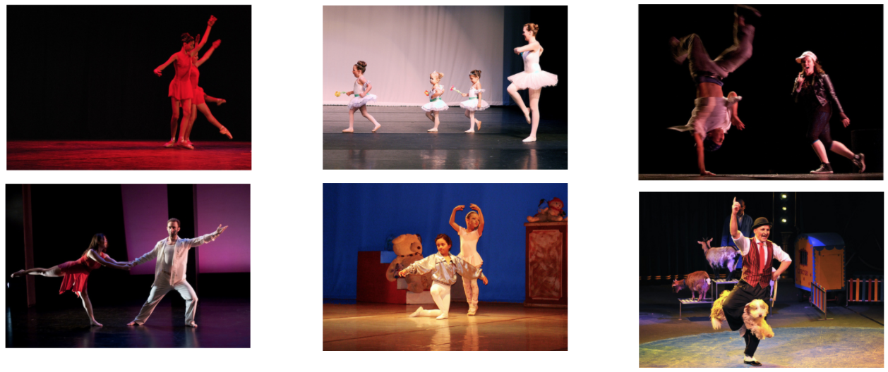

<h1 align="center">Visual Search</h1>

This is the repository accompanying the article:
[Measuring image similarity with N-dimensional vectors](https://blog.filestack.com/thoughts-and-knowledge/measuring-image-similarity-with-n-dimensional-vectors/)

Use deep neural network to aggregate images by visual similarity:

## Quickstart

Use the [introductory notebook](./visual-search.ipynb)

